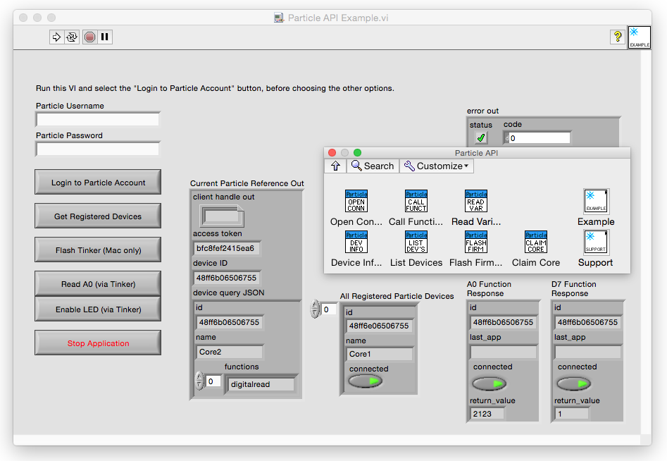

# labview-particle-api

A set of [LabVIEW](https://www.labviewmakerhub.com/doku.php?id=get_labview) VIs to make it easier to connect and control ~~Spark~~ [Particle](http://particle.io) devices via the Particle cloud.

##Installation instructions:
Install the [Particle API VI Package](https://github.com/freddiepingpong/labview-particle-api/blob/master/Distribution/fred_visser_lib_particle_api_for_labview-1.0.0.8.vip) with [VI Package Manager](http://jki.net/vipm) to install the API to your LabVIEW Functions palette.
LabVIEW 2013+
